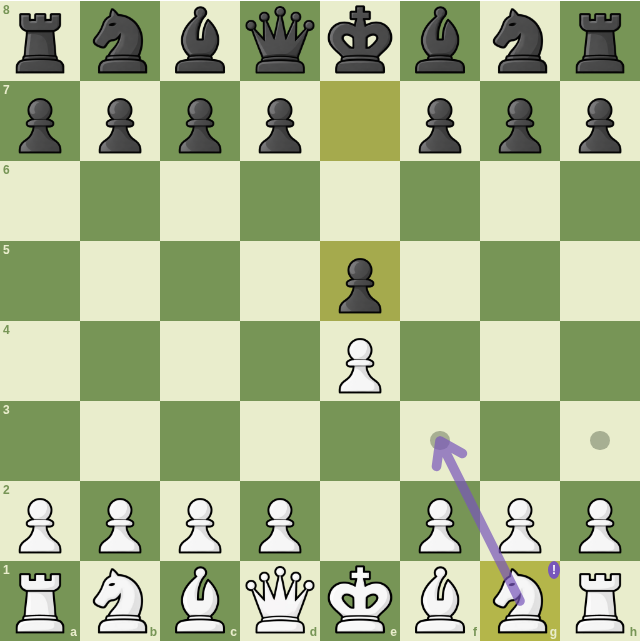

# Knight's Eye Board UI

A controlled chess board for browser applications. Supply positions and allowed
moves; the board renders them and emits move intentions. No framework, engine,
classifier, AI service, game tree or persistent storage is required.



*Actual library rendering after 1.e4 e5. The arrow and badge are host-supplied presentation;
they do not imply an engine evaluation or classification.*

Private preview: `@knights-eye-chess/board-ui@0.1.0-dev.3`. No public registry
release or license grant has been made.

## Responsibilities

| Board UI | Your application |
| --- | --- |
| Squares, pieces, coordinates and orientation | Authoritative position and history |
| Click, drag, keyboard and promotion interaction | Chess legality, turn rules and applying moves |
| Optional arrows, badges and last-move highlights | Meaning of overlays and classifications |
| Isolated styles, focus and disposal | PGN/FEN parsing, navigation, accounts and storage |

Use `mountControlledBoard` for the interactive board. The `/renderer` entry point
exposes square rendering and coordinate helpers for hosts with their own
interaction controller.

## Quick start

Install a checked private archive. These previews are not in the public registry:

```sh
npm install /path/to/knights-eye-chess-board-ui-0.1.0-dev.3.tgz
```

Give the host a width; the board fills it and stays square.

```html
<div id="board" style="width:min(100%, 560px)"></div>
```

```js
import { mountControlledBoard } from '@knights-eye-chess/board-ui';

let state = {
  position: { e1: 'K', e8: 'k', e2: 'P' },
  orientation: 'white', selectedSquare: null,
  permissions: { select: true, move: true, draggable: true },
  legalMoves: ['e2e3', 'e2e4'], positionKey: 'game-one:root'
};
const board = mountControlledBoard(document.querySelector('#board'), {
  state,
  pieceUrl: piece =>
    `/pieces/${piece === piece.toUpperCase() ? 'w' : 'b'}${piece.toLowerCase()}.png`,
  onSelect: square => {
    state = { ...state, selectedSquare: square };
    board.update(state);
  },
  onMove: intent => {
    // Your game validates intent.uci and applies it.
    // Update position, legalMoves and positionKey from that authoritative state.
    console.log(intent.uci, intent.source);
  }
});

board.update({ ...state, orientation: 'black' });
// When the host is removed:
board.dispose();
```

## Optional piece artwork

`assets/pieces/` contains all twelve original glossy PNG sprites: `wp`, `wr`,
`wn`, `wb`, `wq`, `wk` and their black counterparts. They are available through
the `@knights-eye-chess/board-ui/pieces/*` export subpath for build tools.
See [provenance and asset ownership](assets/README.md).

For a simple static application, copy them to the host's public directory:

```sh
mkdir -p public/pieces
cp node_modules/@knights-eye-chess/board-ui/assets/pieces/*.png public/pieces/
```

Supply `/pieces/<name>.png` through `pieceUrl`, as above. Hosts may instead use
bundler asset-URL imports or serve another path. Installing an npm package does
not automatically expose its files through your web server.

Any other piece set works through the same callback. The JavaScript renderer
imports no artwork; it loads only the piece URLs supplied by the host.
The optional sprites add about 4 MiB to the installed package. Their square,
transparent canvases preserve alignment; source files were not cropped or resized.

## State and lifecycle

| Field / method | Contract |
| --- | --- |
| `position` | Algebraic keys (`e4`) mapped to FEN piece letters (`P`, `n`) |
| `orientation` | `white` or `black` |
| `selectedSquare` | A square or `null`; host-controlled |
| `legalMoves` | Exact UCI strings, including promotion suffixes (`a7a8n`) |
| `positionKey` | Occurrence token; change it on navigation even if placement repeats |
| `permissions` | `select`, `move`, optional `draggable` |
| `onMove` | `{ from, to, uci, source, promotion? }`; source is `click`, `drag` or `keyboard` |
| `update(state)` | Complete replacement; mutable host objects are copied |
| `dispose()` | Removes this instance's DOM/listeners; repeated calls are safe |

The board does not parse PGN/FEN, generate legality or commit positions. Reject
a move intention by keeping the current state. Callbacks may synchronously call
`update`; separate mounts have independent DOM and interaction state. Updating
a disposed board throws. Changes to permissions, occurrence, position,
orientation or allowed moves cancel pending gestures and promotion.

## Overlays, themes and accessibility

`lastMove`, `badges` and `arrows` are optional. Their labels, colors and meaning
belong to the host; no classification policy is included. Labels render as text.
`label` names the accessible board grid.

Customize inherited CSS variables: `--board-light`, `--board-dark`,
`--board-focus`, `--board-dialog`, `--board-dialog-text`. Shadow DOM isolates
each instance's layout from the host page.

Use arrows to navigate, Enter/Space to select/move, Home/End for row endpoints
and Escape to cancel. Promotion traps Tab and returns focus. Chromium mouse
behavior is checked at desktop and 375-pixel widths; real touch/iOS remain
unqualified.

## Build, demo and screenshot

Use Node 24 or newer:

```sh
npm ci
npm run check
python3 -m http.server 8080 --bind 127.0.0.1
```

Open `http://127.0.0.1:8080/examples/standalone.html`. Its host-owned allowed
moves and controls demonstrate orientation, promotion, permissions and disposal;
it is not a full game implementation.

```sh
npx playwright install chromium
npm run test:browser
npm run docs:screenshot
```

For a system Chromium, set
`PLAYWRIGHT_CHROMIUM_EXECUTABLE_PATH=/usr/bin/chromium`. The screenshot captures
the real library with 32 loaded sprites and checks for browser errors.

`npm run pack:checked` builds/tests and creates a private archive. Bump versions
before sharing different bytes. Accepted `.1`/`.2` archives remain immutable.
The checked `.3` candidate is committed under `artifacts/` with its hash in
`QUALIFICATION.json`.
New artifacts are adopted explicitly by consumers; this update does not change
the website's installed `.2` package or deploy a site. Manual GitHub checks only.
