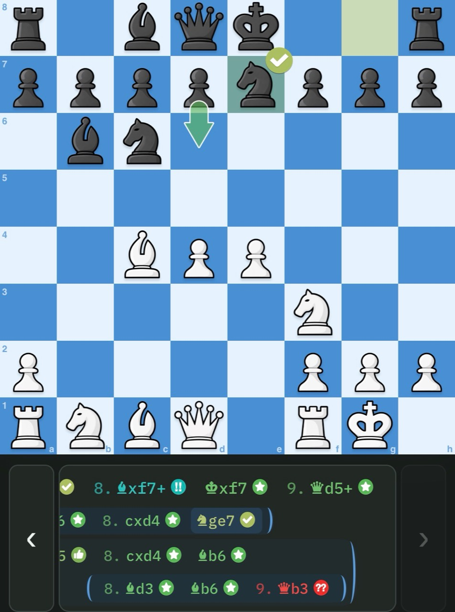

# Knight's Eye Board UI

Chessboards and move navigation for your app, with pieces, animated moves, arrows,
themes and an optional moves strip—all in one framework-free component.

**Optimized for mobile:** drag pieces, tap to move, and swipe through moves and
variations. Board interaction and move-strip scrolling work together, with
keyboard navigation for desktop users too.

Your app supplies the chess positions and decides which moves are legal. Board UI
handles how they look and how people interact with them. It has **zero runtime
dependencies** and works with your choice of chess library.

**[Try three synchronized boards](https://knights-eye-chess.github.io/board-ui/)**
· **[Explore themes and artwork](https://knights-eye-chess.github.io/board-ui/gallery.html)**



Board UI in Knight’s Eye: the host supplies the analysis; the component renders
the board, arrow, badges and nested moves strip.

## What you can build

- Interactive boards with dragging, tap/click moves, promotion choices and animation.
- Game viewers with a moves strip, nested variations and swipe navigation.
- Analysis boards with arrows, highlighted squares and move-quality icons.
- Your own look: custom pieces, icons, arrow shapes and square themes.
- Several boards showing the same game, each with its own size and perspective.

Use the board, moves strip or combined viewer independently. Bring a chess model
such as [chessops](https://github.com/niklasf/chessops), or supply positions yourself.

## Get started

The package is available as a versioned archive in this repository; it is not yet
published on npm. [Download dev.27](https://github.com/knights-eye-chess/board-ui/raw/refs/heads/dev/artifacts/knights-eye-chess-board-ui-0.1.0-dev.28.tgz),
then install it in your app:

```sh
npm install ./knights-eye-chess-board-ui-0.1.0-dev.28.tgz
mkdir -p public/pieces
cp node_modules/@knights-eye-chess/board-ui/assets/pieces/*.png public/pieces/
```

This assumes your app serves `public/` at its web root. The [getting-started
guide](docs/GETTING_STARTED.md) covers asset URLs and a browser setup without a bundler.

Add a place for the board:

```html
<div id="board" style="width: min(100%, 480px)"></div>
```

Then, in your app's JavaScript:

```js
import { mountControlledBoard } from '@knights-eye-chess/board-ui';

let state = {
  position: { e1: 'K', e8: 'k', e2: 'P' },
  orientation: 'white',
  positionKey: 'start',
  selectedSquare: null,
  permissions: { select: false, move: false },
  legalMoves: []
};

const board = mountControlledBoard(document.querySelector('#board'), {
  state,
  pieceUrl: piece => `/pieces/${piece === piece.toUpperCase() ? 'w' : 'b'}${piece.toLowerCase()}.png`,
  onSelect() {},
  onMove() {}
});
```

You now have a board showing two kings and a pawn. The [interactive
example](docs/GETTING_STARTED.md#let-people-move-a-piece) adds selection and moves.

## How it works

Think of Board UI as the display and controls for your chess model:

1. Your app sends a position, legal moves and the current selection.
2. A player taps, drags or uses the keyboard; Board UI reports what they chose.
3. Your app applies the move and sends the updated position back.

For a game viewer, you can also change positions directly:

```js
state = {
  ...state,
  position: { e1: 'K', e8: 'k', e4: 'P' },
  positionKey: 'after-e4',
  lastMove: ['e2', 'e4']
};
board.update(state);
```

The board animates the change. Your app talks to it through APIs and events;
it does not need to manipulate the board's HTML. See the [API
reference](docs/API.md) for the full contract.

## Make it yours

Flip the board by updating `orientation`, or change its presentation at any time:

```js
board.updateAppearance({
  themeTokens: { light: '#f1e4d1', dark: '#b88763' },
  coordinates: { visible: false },
  animation: { durationMs: 200 }
});

board.updateOverlays('suggestions', {
  arrows: [{ from: 'e2', to: 'e4', label: 'Pawn advance',
    style: 'arrow-broad-head-rounded-tail', color: '#31715e' }]
});
```

Bundled artwork and styles are ready to use. You can also add named piece sets,
icon sets, arrow shapes and square themes when building your app, then select them
through the API. The [appearance guide](docs/APPEARANCE.md) shows how.

## Add a moves strip

The optional moves strip displays move numbers, notation and nested variations.
People can tap a move or swipe through a line to navigate the game. Use
`mountBoardViewer` to combine it with a board, or `mountMoveStrip` on its own.

Choose the presentation that fits your app:

| Plain game viewer | Analysis app |
| --- | --- |
| `classifications: false` | Classifications enabled by default |
| Compact moves in your theme's normal text color | Move-quality colors and icons |
| No space reserved for icons | Reserved space keeps moves steady as analysis arrives |

See the [moves-strip guide](docs/MOVE_STRIP.md) for a complete board-and-strip
example. The [three-board demo](https://github.com/knights-eye-chess/board-ui/blob/dev/examples/demos/README.md) shows shared navigation,
including Up/Down to switch branches.

## Documentation and development

- [Getting started](docs/GETTING_STARTED.md): installation, assets and your first interactive board.
- [Appearance](docs/APPEARANCE.md): themes, custom artwork, arrows and badges.
- [Moves strip](docs/MOVE_STRIP.md): plain/classified moves, variations and navigation.
- [API reference](docs/API.md): state, callbacks, gestures and styling options.
- [Development](docs/DEVELOPMENT.md): run the demos, build and test.

To explore locally, use Node 24 or newer:

```sh
git clone --branch dev https://github.com/knights-eye-chess/board-ui.git
cd board-ui
npm ci
npm ci --prefix examples/demos
npm run demo:serve
```

Open `http://localhost:4173`. The demos include an integration walkthrough and
their source code.

## Licenses and credits

Board UI code is **[MIT](LICENSE)**. The bundled and original demo artwork is
**[CC BY 4.0](LICENSE-ARTWORK)**; credit Knight's Eye contributors when reusing it.

The three-board demo uses chessops and is distributed under **GPL-3.0-or-later**,
with its corresponding source available from the demo footer. The standalone
library and appearance gallery retain their MIT terms. See [licensing
details](LICENSING.md) and [artwork credits](assets/README.md).
